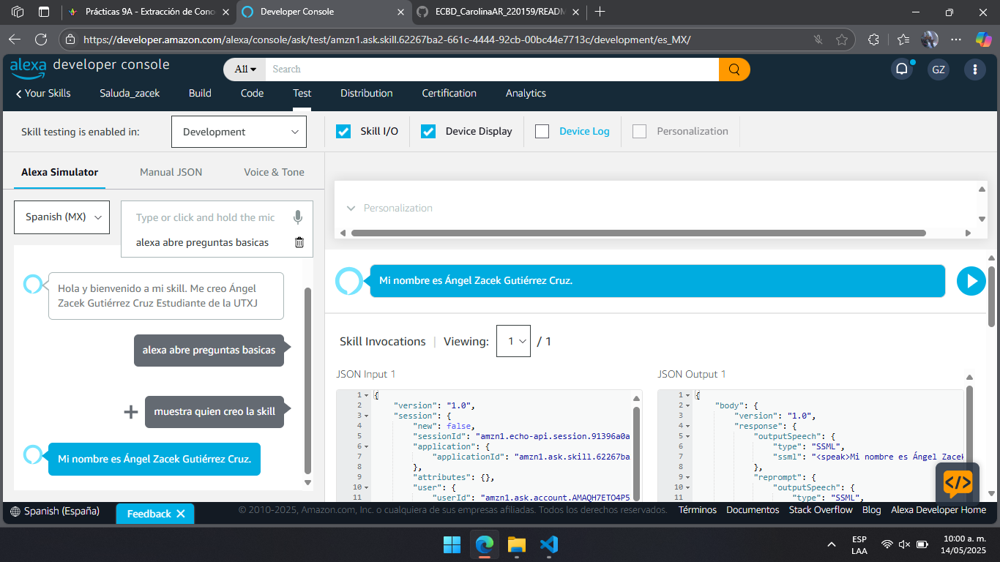
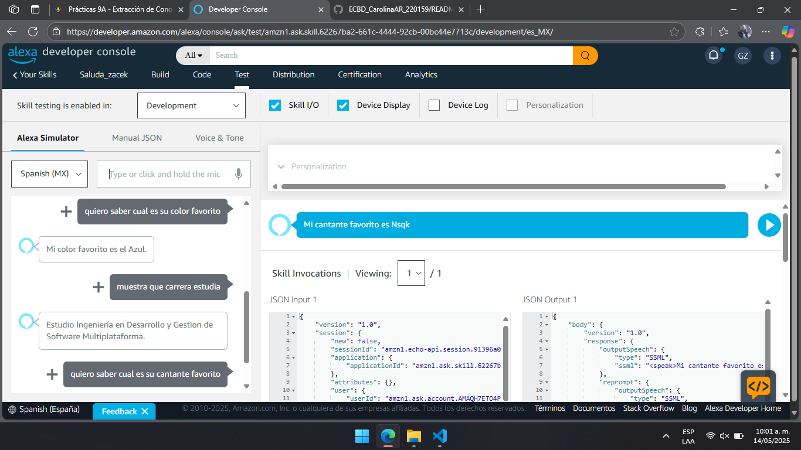
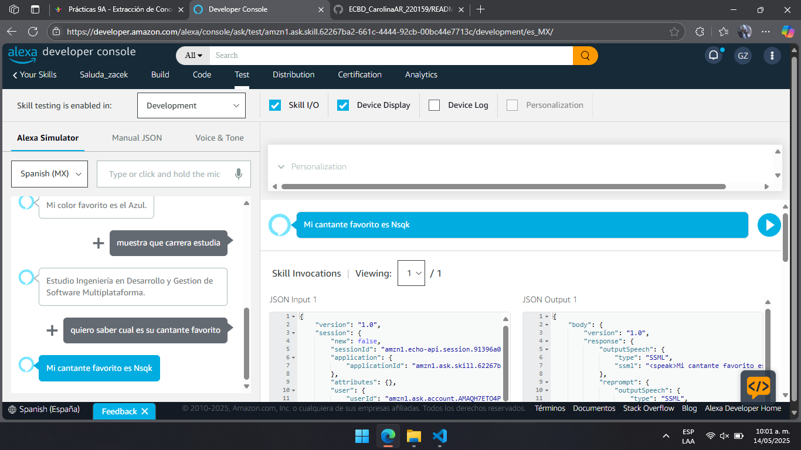

  
  

# Practica 03: FUNCIONALIDADES POR COMANDOS DE VOZ

## Elaborado por Ángel Zacek Gutiérrez Cruz
Grupo: 9A IDGS
 
Fecha: 14/05/2025
 
Asignatura: Extraccion de Conocimientos de Base de Datos
 
Profesor: Marco A. Ramírez Hernández

### Descripción de la Practica
En esta actividad, el estudiante actualizó una práctica previa con el objetivo de ampliar la funcionalidad de una aplicación conversacional mediante el reconocimiento y respuesta a cuatro preguntas específicas.

### Objetivo:
Mejorar la interacción de la aplicación mediante el uso de intents personalizados para responder a preguntas comunes relacionadas con el desarrollador.

### Evidencias:
Se adjuntan evidencias del testeo:

  

  

